# OpenCV Computer Vision - Image and Video Processing

This repository demonstrates the use of OpenCV for a variety of computer vision tasks, including image and video processing using Python. It covers fundamental concepts in computer vision, from basic image operations to advanced techniques like feature matching and face detection.

## Project Aim
The main objectives include:
1. Reading, writing, and displaying images using OpenCV.
2. Performing arithmetic operations on images like addition, subtraction, and blending.
3. Converting images between different color spaces (BGR to Grayscale and HSV).
4. Applying thresholding techniques including simple, adaptive, and Otsu thresholding.
5. Smoothing images using various filters such as averaging, Gaussian, median, and bilateral.
6. Performing morphological transformations such as erosion, dilation, opening, and closing.
7. Detecting edges in images using the Canny edge detection method.
8. Implementing template matching to find smaller image regions within a larger image.
9. Performing feature matching between images using SIFT and ORB techniques.
10. Processing video frames using OpenCV and saving selected frames.
11. Detecting faces and eyes in images using pre-trained Haar cascade classifiers.


## Contents

### 1. Reading, Writing, and Displaying Images
- **Script:** `image_processing.py`
- **Description:** This script demonstrates how to read, write, and display images using OpenCV.
- **Images:**
  - 

### 2. Arithmetic Operations on Images
- **Script:** `arithmetic_operations.py`
- **Description:** Perform arithmetic operations on images such as:
  - **Addition:** Combines two images by adding pixel values, increasing brightness or highlighting overlapping regions.
  - **Subtraction:** Subtracts pixel values of one image from another, useful for highlighting differences between images.
  - **Blending:** Combines two images using weighted sums, creating a smooth transition between them.
- **Images:**
  - Addition: 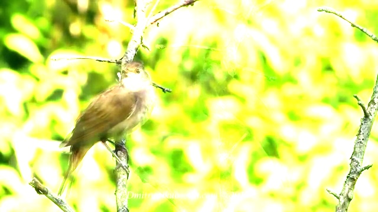
  - Subtraction: 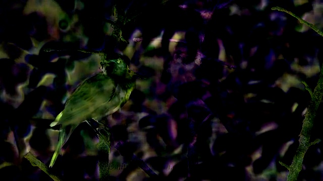
  - Blending: 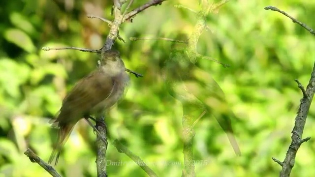

### 3. Color Space Conversion
- **Script:** `color_spaces.py`
- **Description:** Convert images between different color spaces to facilitate various image processing tasks:
  - **BGR to Grayscale:** Converts the image from Blue-Green-Red (BGR) to Grayscale, simplifying the image and reducing computational complexity.
  - **BGR to HSV:** Converts the image from BGR to Hue-Saturation-Value (HSV) for easier color-based segmentation and filtering.
  - **Tracking Blue Color:** Isolates a specific color (blue in this case) in the HSV color space, useful for color tracking and segmentation.
- **Images:**
  - Grayscale: 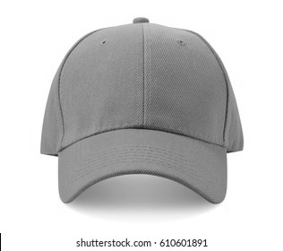
  - HSV: 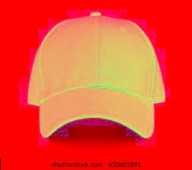
  - Tracked Blue Color: 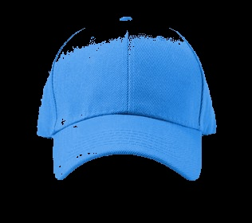

### 4. Image Thresholding
- **Script:** `thresholding.py`
- **Description:** Apply different thresholding techniques to separate objects from the background in an image:
  - **Simple Threshold:** Applies a fixed threshold value to the image, converting all pixel values above the threshold to the maximum value and below to zero, creating a binary image.
  - **Adaptive Threshold:** Calculates the threshold value for smaller regions of the image, allowing for variations in lighting and producing a more dynamic binary image.
  - **Otsu's Threshold:** Automatically determines the optimal threshold value by minimizing the intra-class variance, making it ideal for images with bimodal histograms.
- **Images:**
  - Simple Threshold: 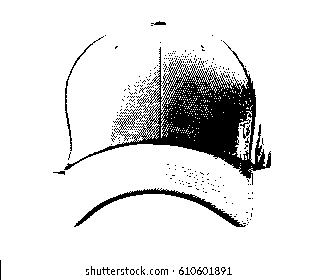
  - Adaptive Threshold: 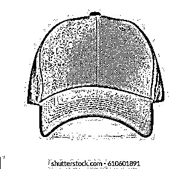

### 5. Image Smoothing
- **Script:** `smoothing.py`
- **Description:** Smooth images using various filtering techniques to reduce noise and detail:
  - **Averaging Blur:** Calculates the average of the pixel values in a kernel around each pixel, resulting in a smooth image by reducing high-frequency noise.
  - **Gaussian Blur:** Applies a Gaussian kernel to the image, giving more weight to the central pixels, resulting in a smoother and more natural blur effect.
  - **Median Blur:** Replaces each pixel's value with the median of the pixel values in a surrounding kernel, effectively reducing noise while preserving edges.
  - **Bilateral Filter:** Smooths the image while preserving edges by taking into account both the spatial proximity and the intensity difference between pixels.
- **Images:**
  - Averaging Blur: 
  - Gaussian Blur: 
  - Median Blur: 
  - Bilateral Filter: 

### 6. Morphological Transformations
- **Script:** `morphology.py`
- **Description:** Morphological operations are used to process and analyze binary images. These operations include:
  - **Erosion:** Removes pixels on object boundaries, which helps in removing small noise.
  - **Dilation:** Adds pixels to the boundaries of objects, which is useful for connecting disjoint objects.
  - **Opening:** An erosion followed by a dilation. It removes small noise while maintaining the shape of larger objects.
  - **Closing:** A dilation followed by an erosion. It fills small holes in objects and connects disjoint elements.
- **Images:**
  - Eroded Image: 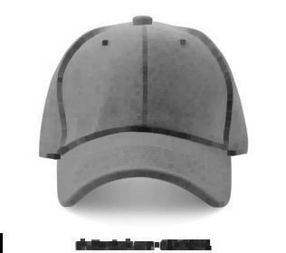
  - Dilated Image: 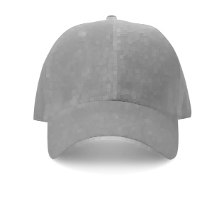
  - Opening: 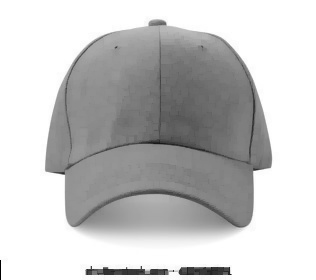
  - Closing: 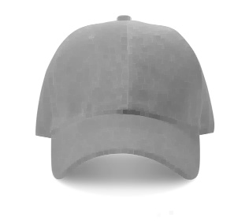

### 7. Edge Detection
- **Script:** `edge_detection.py`
- **Description:** Edge detection is used to identify the boundaries within an image. The Canny edge detection method:
  - **Canny Edge Detection:** A multi-stage process that detects edges by looking for areas of rapid intensity change. It involves applying Gaussian blurring, finding the intensity gradient, and tracing edges using hysteresis, which is a technique in edge detection that uses two thresholds (high and low) to identify strong and weak edges, ensuring only significant edges are preserved by connecting weak edges that are adjacent to strong ones.
- **Images:**
  - Canny Edge Detection: 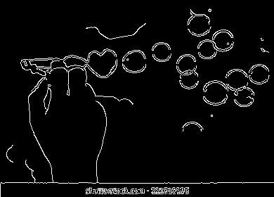

### 8. Template Matching
- **Script:** `template_matching.py`
- **Description:** Template matching is used to locate a specific pattern or object within an image. The process involves sliding the template image over the input image (as in 2D convolution) and finding the region where the template best matches the input image.
- **Images:**
  - Template Matching Result: 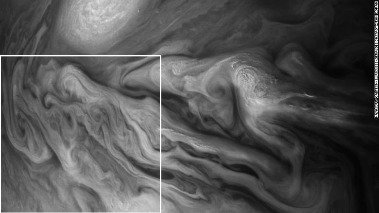

### 9. Feature Matching
- **Script:** `feature_matching.py`
- **Description:** Feature matching involves detecting and describing key points in images using techniques like SIFT (Scale-Invariant Feature Transform) and ORB (Oriented FAST and Rotated BRIEF). SIFT is effective for detecting distinct key points and is scale and rotation invariant, while ORB provides a fast alternative for matching binary descriptors, which are a type of image feature descriptor used in computer vision to describe key points in an image. 
- **Images:**
  - SIFT Feature Matching: 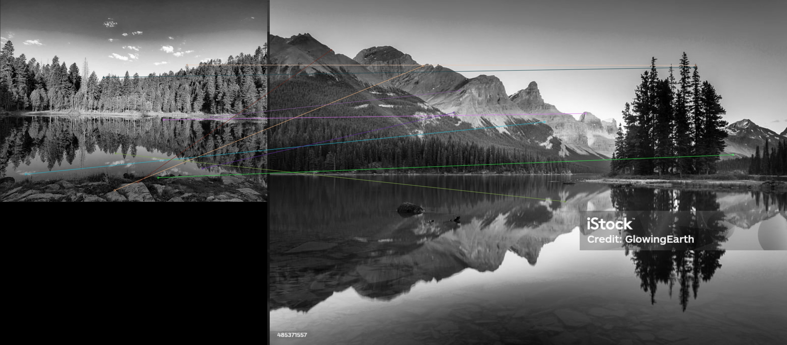
  - ORB Feature Matching: 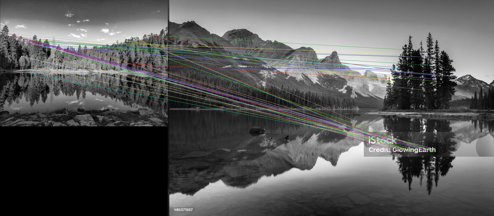

### 10. Video Processing
- **Script:** `video_processing.py`
- **Description:** Extracts and saves every nth frame from a video file. This can be useful for analyzing specific frames in a video without processing the entire footage.
- **Images:** A sample of saved frames from the video.
  - 
  - 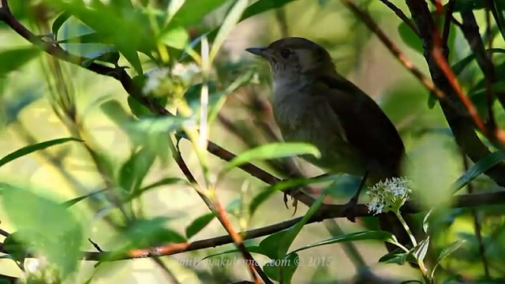
  - 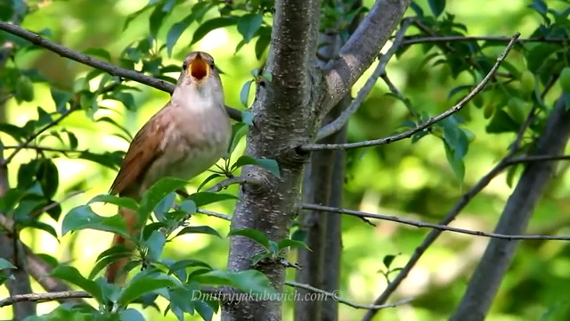
  - 
### 11. Face and Eye Detection
- **Script:** `face_eye_detection.py`
- **Description:** Utilizes Haar cascade classifiers to detect faces and eyes in an image. Haar cascade are machine-learning based classifiers trained to identify facial regions and eyes, drawing rectangles around detected areas, providing a basis for facial recognition and analysis. 
- **Images:**
  - Face and Eye Detection: 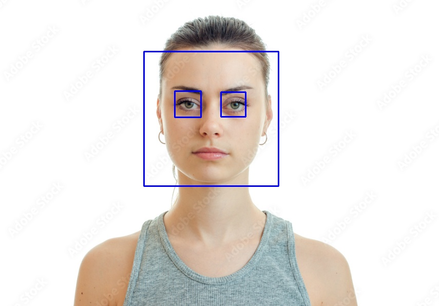

## Setup
1. Clone this repository.
2. Install the required packages using the command:
   ```bash
   pip install -r requirements.txt
   ``` 

## Requirements
Python 3.x
OpenCV
NumPy
Matplotlib

Note- Refer to each script for the code and more information on how these tasks are performed.
