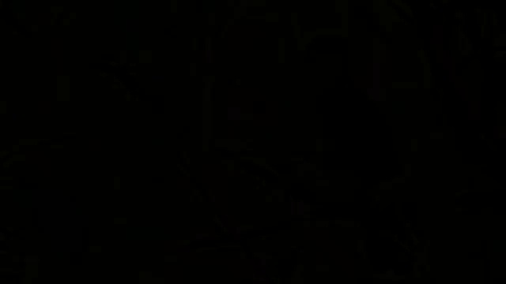

# OpenCV Computer Vision - Image and Video Processing

This repository demonstrates the use of OpenCV for a variety of computer vision tasks, including image and video processing using Python. It covers fundamental concepts in computer vision, from basic image operations to advanced techniques like feature matching and face detection.

## Project Aim
The main objectives include:
1. Reading, writing, and displaying images using OpenCV.
2. Performing arithmetic operations on images like addition, subtraction, and blending.
3. Converting images between different color spaces (BGR to Grayscale and HSV).
4. Applying thresholding techniques including simple, adaptive, and Otsu thresholding.
5. Smoothing images using various filters such as averaging, Gaussian, median, and bilateral.
6. Performing morphological transformations such as erosion, dilation, opening, and closing.
7. Detecting edges in images using the Canny edge detection method.
8. Implementing template matching to find smaller image regions within a larger image.
9. Performing feature matching between images using SIFT and ORB techniques.
10. Processing video frames using OpenCV and saving selected frames.
11. Detecting faces and eyes in images using pre-trained Haar cascade classifiers.


## Contents

### 1. Reading, Writing, and Displaying Images
- **Script:** `image_processing.py`
- **Description:** This script demonstrates how to read, write, and display images using OpenCV.
- **Images:**
  - 

### 2. Arithmetic Operations on Images
- **Script:** `arithmetic_operations.py`
- **Description:** Perform arithmetic operations like addition, subtraction, and blending on images.
- **Images:**
  - Addition: 
  - Subtraction: 
  - Blending: 

### 3. Color Space Conversion
- **Script:** `color_spaces.py`
- **Description:** Convert images between different color spaces (BGR to Grayscale and HSV).
- **Images:**
  - Grayscale: 
  - HSV: 
  - Tracked Blue Color: 

### 4. Image Thresholding
- **Script:** `thresholding.py`
- **Description:** Apply different thresholding techniques such as simple, adaptive, and Otsu.
- **Images:**
  - Simple Threshold: 
  - Adaptive Threshold: 

### 5. Image Smoothing
- **Script:** `smoothing.py`
- **Description:** Smooth images using various filters like averaging, Gaussian, median, and bilateral.
- **Images:**
  - Averaging Blur: 
  - Gaussian Blur: 
  - Median Blur: 
  - Bilateral Filter: 

### 6. Morphological Transformations
- **Script:** `morphology.py`
- **Description:** Apply morphological operations such as erosion, dilation, opening, and closing.
- **Images:**
  - Eroded Image: 
  - Dilated Image: 
  - Opening: 
  - Closing: 

### 7. Edge Detection
- **Script:** `edge_detection.py`
- **Description:** Detect edges in images using the Canny edge detection method.
- **Images:**
  - Canny Edge Detection: 

### 8. Template Matching
- **Script:** `template_matching.py`
- **Description:** Use template matching to find a smaller image region within a larger image.
- **Images:**
  - Template Matching Result: 

### 9. Feature Matching
- **Script:** `feature_matching.py`
- **Description:** Perform feature matching between images using SIFT and ORB techniques.
- **Images:**
  - SIFT Feature Matching: 
  - ORB Feature Matching: 

### 10. Video Processing
- **Script:** `video_processing.py`
- **Description:** Process video frames and save every nth frame.
- **Images:** A sample of saved frames from the video.
  - 
  - 
  - 

### 11. Face and Eye Detection
- **Script:** `face_eye_detection.py`
- **Description:** Detect faces and eyes in an image using Haar cascade classifiers.
- **Images:**
  - Face and Eye Detection: 

## Setup
1. Clone this repository.
2. Install the required packages using the command:
   ```bash
   pip install -r requirements.txt
   ``` 

## Requirements
Python 3.x
OpenCV
NumPy
Matplotlib

Note- Refer to each script for the code and more information on how these tasks are performed.